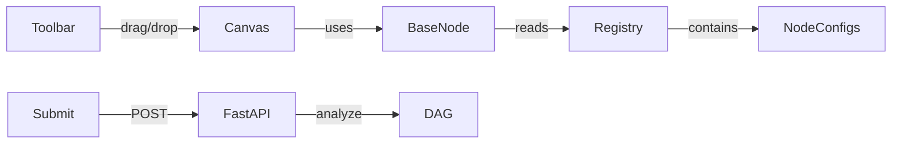

# VectorShift Pipeline Editor

A node-based pipeline editor built with React Flow and FastAPI. Features a config-driven node abstraction where every node type is defined as a plain config object — no custom components needed.

## How to Run

### Backend

```bash
cd backend
uvicorn main:app --reload
```

The API runs on `http://localhost:8000`.

### Frontend

```bash
cd frontend
npm install
npm start
```

The UI opens at `http://localhost:3000`.

### Tests

```bash
cd backend
python3 -m pytest test_main.py -v
```

## Architecture



## Adding a New Node

Create a config object in `frontend/src/nodes/` and register it in `registry.js`:

```js
import { Zap } from 'lucide-react';

export const myNodeConfig = {
  type: 'myNode',
  category: 'transform',
  title: 'My Node',
  icon: Zap,
  accentColor: 'var(--cat-transform)',
  fields: [
    { name: 'value', type: 'text', label: 'Value', default: '' },
  ],
  handles: [
    { id: 'in', type: 'target', position: 'left' },
    { id: 'out', type: 'source', position: 'right' },
  ],
};
```

No component code needed. The `BaseNode` renders it automatically.

## Design Decisions

- **Node Registry Pattern**: All node types share a single `BaseNode` component. A config object defines fields, handles, icons, and styling. Adding a node = writing 20 lines of JSON-like config.
- **Dark-first Theme**: CSS custom properties power a dark-by-default theme with a light mode toggle persisted in `localStorage`.
- **Dynamic Handles**: The Text node's `{{ variable }}` handles and the Switch node's configurable outputs are computed at render time via function-based handle configs.
- **Kahn's Algorithm**: The DAG check on the backend uses pure Python — no `networkx` dependency. It reports cycle paths and topological order.
- **Type Safety**: Pydantic v2 models enforce request/response contracts end-to-end.
