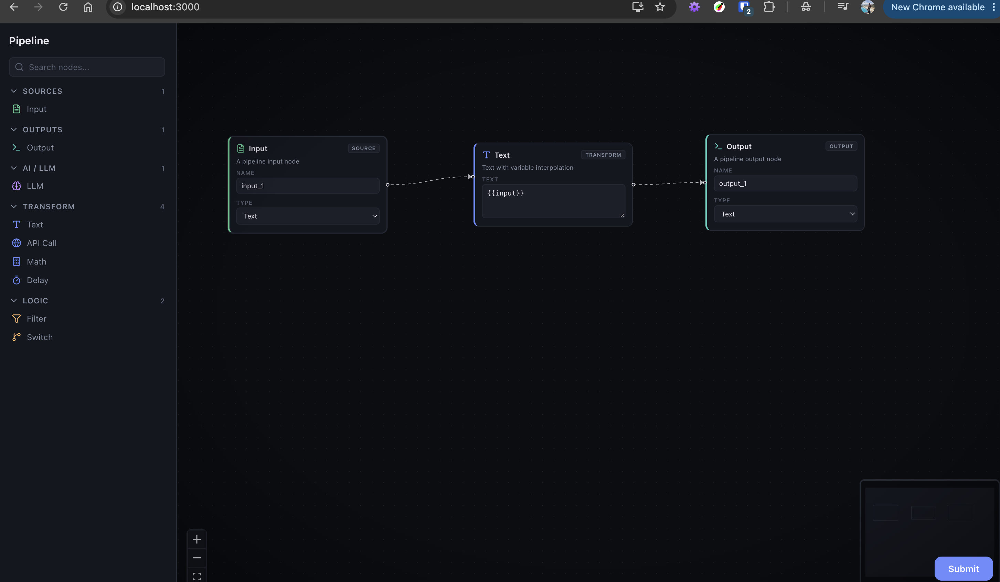
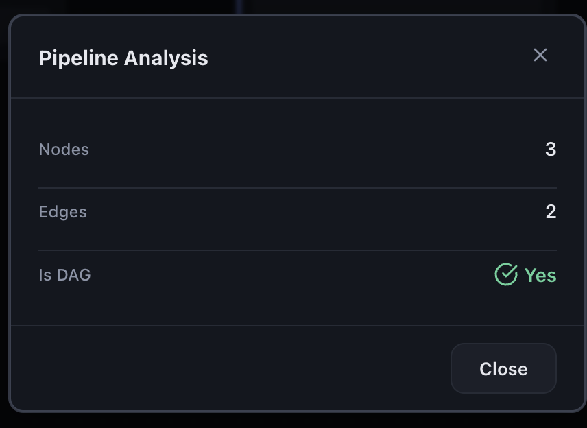
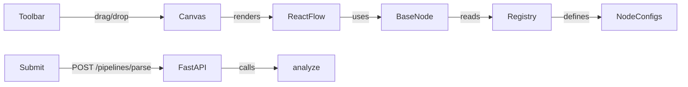

# VectorShift Pipeline Editor

A polished pipeline builder that lets users compose node-based workflows in a visual canvas, then validate the resulting graph through a FastAPI backend.

This project was built as a frontend-focused technical assessment, but I treated it like a small product: reusable node architecture, dynamic UI behavior, clean state management, and backend validation that reinforces the editor experience.

## Screenshots

### Editor canvas



## Highlights

- Config-driven node system built on top of React Flow
- Reusable `BaseNode` that renders every node type from plain config objects
- Dynamic Text node handles generated from `{{variable}}` tokens in user input
- Strict Input -> Text variable-handle matching (Input name must match `{{variable}}`)
- Text node auto-resizes as content grows for better authoring visibility
- Drag-and-drop canvas with animated edges, minimap, controls, and grid snapping
- FastAPI analysis endpoint that validates whether a submitted pipeline is a DAG
- Graph analysis utility that computes cycles and topological order
- Clean modal-based submission feedback in the UI

## Why This Stands Out

Instead of creating one-off React components for every node, the editor uses a registry pattern where each node is described by metadata: fields, handles, icon, color, and behavior. That keeps the system easy to scale, easy to reason about, and much closer to how production workflow builders are usually modeled.

The most interesting product requirement is the Text node. Users can write templates like:

```text
Hello {{name}}, your score is {{score}}
```

The editor parses the variables, creates matching input handles on the left side of the node, and keeps a single output handle on the right. That turns free-form text input into graph structure without making the UI feel complicated.

## Tech Stack

- Frontend: React, React Flow, Zustand, Lucide Icons
- Backend: FastAPI, Pydantic
- Testing: Pytest
- Styling: Custom CSS with theme tokens

## Demo Features

### 1. Visual workflow composition

Users can drag nodes from the toolbar onto the canvas, connect them visually, and submit the resulting graph for analysis.

### 2. Extensible node architecture

Current node set includes:

- Input
- Output
- LLM
- Text
- Filter
- API
- Math
- Switch
- Delay

Adding a new node does not require a new custom component in the common case. A config object is usually enough.

### 3. Dynamic handles from user text

The Text node supports variable interpolation using double curly braces:

```text
{{input}}
{{userName}}
{{score}}
```

Each valid JavaScript-style variable name becomes a target handle on the left side of the node. Duplicate variables are de-duplicated automatically, and invalid placeholders are ignored for handle creation.

Connection behavior is strict for Text variable binding: an Input node can connect to a Text variable handle only when the Input node's `Name` exactly matches the variable handle name.

The Text node also grows in width and height as users type more content, which improves readability for long templates and multi-line text.

### 4. Graph validation

On submit, the frontend sends the current nodes and edges to the backend, which:

- counts nodes
- counts edges
- reports whether the graph is a DAG

Under the hood, the graph analysis logic also computes cycle information and topological ordering, which makes the backend easy to extend further.



This keeps the project grounded in both frontend interaction design and algorithmic correctness.

## Architecture



### Frontend design

- `frontend/src/nodes/registry.js` maps node types to config objects
- `frontend/src/nodes/BaseNode.js` renders fields and handles generically
- `frontend/src/canvas/Canvas.js` manages drag/drop, viewport behavior, and React Flow wiring
- `frontend/src/store.js` applies connection validation rules (including strict Text variable matching)
- `frontend/src/submit.js` serializes the graph and presents analysis results in a modal

### Backend design

- `backend/main.py` exposes the parsing endpoint and health check
- `backend/dag.py` performs graph analysis, cycle detection, and topological sorting
- `backend/models.py` defines request and response contracts with Pydantic

## Example: Adding a New Node

Create a config object in `frontend/src/nodes/` and register it in `registry.js`:

```js
import { Zap } from 'lucide-react';

export const myNodeConfig = {
  type: 'myNode',
  category: 'transform',
  title: 'My Node',
  icon: Zap,
  accentColor: 'var(--cat-transform)',
  fields: [
    { name: 'value', type: 'text', label: 'Value', default: '' },
  ],
  handles: [
    { id: 'in', type: 'target', position: 'left' },
    { id: 'out', type: 'source', position: 'right' },
  ],
};
```

That config is automatically rendered by the shared `BaseNode`, which keeps node creation lightweight and consistent.

## How to Run

### Backend

```bash
cd backend
cp .env.example .env
pip install -r requirements.txt
uvicorn main:app --reload
```

Expected `backend/.env` values:

```env
BACKEND_CORS_ORIGINS=http://localhost:3000,http://127.0.0.1:3000
BACKEND_CORS_ALLOW_CREDENTIALS=true
BACKEND_CORS_ALLOW_METHODS=*
BACKEND_CORS_ALLOW_HEADERS=*
```

The API runs on `http://localhost:8000`.

### Frontend

```bash
cd frontend
cp .env.example .env
npm install
npm start
```

Expected `frontend/.env` values:

```env
REACT_APP_API_URL=http://localhost:8000
```

The UI runs on `http://localhost:3000`.

## Tests

```bash
cd backend
python3 -m pytest test_main.py -v
```

## What I Optimized For

- Reusability over one-off node components
- UI behavior that directly reflects user intent
- Clear separation between editor concerns and graph analysis concerns
- Extensibility so additional nodes can be added quickly
- Product polish in addition to functional correctness

## Possible Next Steps

- Persist and restore saved pipelines
- Add inline warnings for invalid Text node variables
- Add automated frontend tests for dynamic handle generation
- Support execution semantics beyond graph validation
